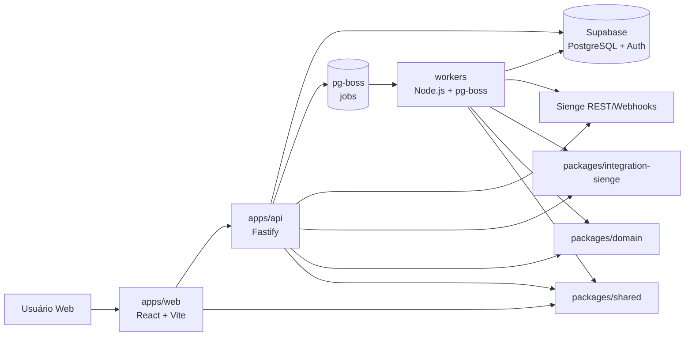
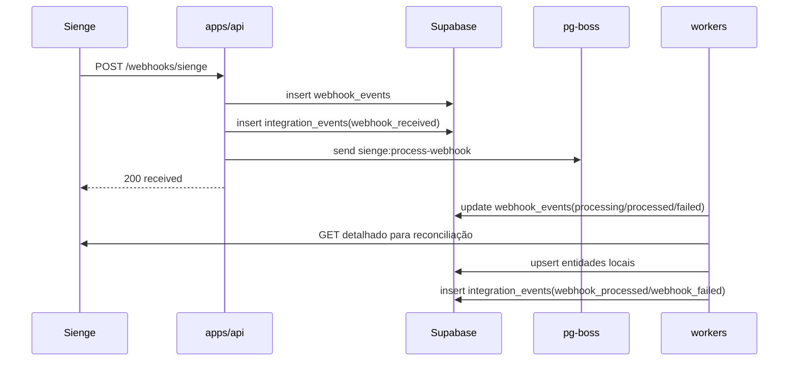
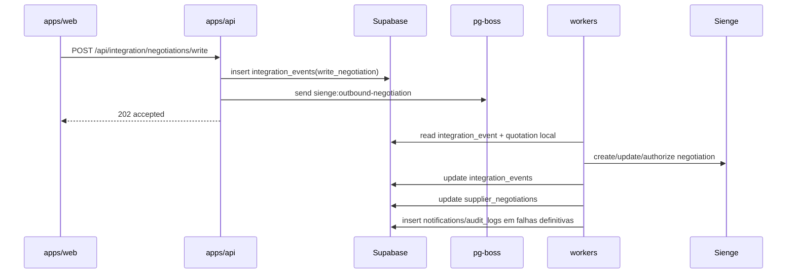
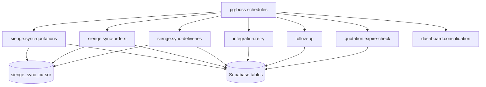
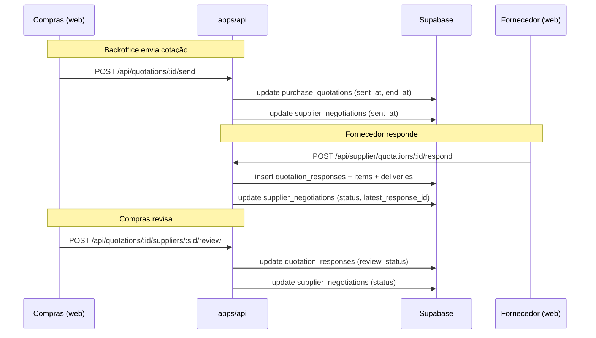

# Arquitetura Atual

Atualizado em `2026-05-02` para refletir o estado real do monorepo.

## 1. Visão geral

O projeto opera como um monorepo `pnpm` com cinco blocos principais:

- SPA React em `apps/web`
- API dedicada em `apps/api`
- runtime assíncrono em `workers`
- pacotes compartilhados em `packages/*`
- persistência/autenticação em `supabase`

O sistema foi desenhado para manter:

- operação síncrona curta na API
- processamento assíncrono em `pg-boss`
- dados operacionais locais no Supabase
- Sienge como fonte de verdade externa para cotações, pedidos, entregas e credores

### 1.1 Toolchain e dependências

- **TypeScript:** `^5.6.0` nos pacotes Node (`apps/api`, `workers`, `packages/integration-sienge`); `apps/web` usa a série suportada pelo Vite (`~6.x`).
- **Vitest:** `^4.1.4` em todos os workspaces com testes unitários (incluindo `workers`, com `vitest.config.ts` e `pool: forks` para estabilidade).
- **Supabase JS:** `@supabase/supabase-js ^2.105.1` em API e workers.
- **Zod:** major 3 em `shared`/API/web; major 4 apenas em `packages/integration-sienge` — ver [`packages/integration-sienge/CLAUDE.md`](../packages/integration-sienge/CLAUDE.md).
- **E2E:** Playwright em `apps/web/e2e/` com API mockada no browser; workflow [`e2e.yml`](../.github/workflows/e2e.yml).

## 2. Diagrama de componentes

## 3. Diagrama de serviços e fluxos

### 3.1 Fluxo inbound por webhook

### 3.2 Fluxo outbound de negociação

### 3.3 Fluxo de polling

### 3.4 Fluxo de cotação (PRD-02)

## 4. Inventário técnico com versões e racional

| Camada        | Tecnologia                        | Versão observada          | Uso atual                   | Racional                                           |
| ------------- | --------------------------------- | ------------------------- | --------------------------- | -------------------------------------------------- |
| Workspace     | `pnpm`                            | lockfile v10              | gerenciamento do monorepo   | isolamento de dependências e filtros por workspace |
| Frontend      | `react`                           | `19.2.4`                  | SPA                         | ecossistema atual da interface                     |
| Frontend      | `react-router-dom`                | `7.14.0`                  | rotas protegidas e admin    | roteamento moderno e simples                       |
| Frontend      | `vite`                            | `8.0.7`                   | dev server e build          | build rápido para SPA                              |
| Frontend      | `react-hook-form`                 | `7.72.1`                  | formulários de auth e admin | menor custo de renderização                        |
| Frontend      | `axios`                           | `1.15.0`                  | cliente HTTP                | interceptors de auth                               |
| Frontend      | `lucide-react`                    | `1.8.0`                   | ícones                      | biblioteca de ícones leve e moderna                |
| Frontend      | `date-fns`                        | `4.1.0`                   | formatação de datas         | utilitário de datas tree-shakeable                 |
| API           | `fastify`                         | `5.8.5`                   | servidor HTTP               | performance, plugins e `inject()`                  |
| API           | `@fastify/jwt`                    | `10.0.0`                  | JWT próprio da aplicação    | autenticação interna e RBAC                        |
| API           | `@fastify/swagger` + `swagger-ui` | `9.4.0` / `5.2.0`         | documentação em `/docs`     | inspeção rápida de contratos                       |
| API           | `fastify-type-provider-zod`       | `4.0.2`                   | validação e tipagem         | reaproveita schemas Zod                            |
| API           | `prom-client`                     | `15.1.3`                  | métricas Prometheus         | observabilidade de produção                        |
| Workers       | `pg-boss`                         | `9.0.3`                   | fila, agendamento e retry   | evita Redis adicional                              |
| Workers       | `prom-client`                     | `15.1.3`                  | métricas Prometheus         | observabilidade de produção                        |
| Integração    | `axios-retry`                     | `4.5.0`                   | retry HTTP idempotente      | resiliência básica                                 |
| Integração    | `bottleneck`                      | `2.19.5`                  | rate limiting               | controla limites REST/BULK do Sienge               |
| Compartilhado | `zod`                             | `3.23.8` e `4.3.6`        | schemas e validação         | padroniza DTOs e env parsing                       |
| Persistência  | Supabase JS                       | `^2.45.0` / `^2.39.0`     | acesso ao banco/auth        | cliente padrão do ecossistema                      |
| Testes        | `vitest`                          | `1.4.0`, `2.1.0`, `4.1.4` | unitários e integração      | execução rápida em Node/jsdom                      |
| Qualidade     | `eslint`                          | `9.39.4`                  | lint por workspace          | flat config                                        |
| Qualidade     | `prettier`                        | `3.8.1`                   | formatação                  | padronização transversal                           |
| Frontend      | `recharts`                        | `2.15.4`                  | gráficos de dashboard       | séries temporais de evolução PRD-08                |
| Workers       | `pg`                              | `8.11.3`                  | transações atômicas         | escrita de snapshot PRD-08 via `BEGIN`/`COMMIT`    |

### Observações de arquitetura técnica

- Há heterogeneidade de versões de `vitest`, `typescript`, `@types/node`, `zod` e `@supabase/supabase-js` entre workspaces.
- O pacote `apps/` (raiz do diretório apps) permanece com um scaffold Vite genérico e não deve ser tratado como aplicação de produção.
- `workers/dist` está presente no repositório; tratar como artefato gerado e não como fonte.

## 5. Estrutura de diretórios e aderência

| Diretório                     | Papel                    | Aderência observada | Observações                                                                                                                                  |
| ----------------------------- | ------------------------ | ------------------- | -------------------------------------------------------------------------------------------------------------------------------------------- |
| `apps/web`                    | frontend real            | boa                 | rotas, contexto e páginas coerentes com o módulo; PRD-02, PRD-05, PRD-04, PRD-06 e PRD-08 implementados; dashboard com Recharts e paleta PRD |
| `apps/api`                    | backend real             | boa                 | módulos separados por domínio; PRD-02, PRD-05, PRD-06 e PRD-08 implementados; dashboard com 7 endpoints e RBAC                               |
| `workers`                     | processamento assíncrono | boa                 | jobs segregados por caso de uso; infra de observabilidade e test-utils; recálculo de status PRD-05; consolidação diária atômica PRD-08       |
| `packages/domain`             | domínio                  | média-boa           | entidades centrais, `OrderStatusEngine` (PRD-05) e testes unitários                                                                          |
| `packages/integration-sienge` | infraestrutura de ERP    | boa                 | clientes e mapeadores bem segmentados; cobertura de testes                                                                                   |
| `packages/shared`             | contratos                | boa                 | schemas Zod e tipos compartilhados; inclui schemas de cotação                                                                                |
| `supabase`                    | plataforma de dados      | boa                 | 17 migrações versionadas; PRD-02, PRD-05, PRD-03, PRD-04, PRD-06 e PRD-08 com RLS                                                            |
| `deploy`                      | infraestrutura de deploy | boa                 | K8s manifests com Kustomization                                                                                                              |
| `apps`                        | residual de template     | baixa               | manter só como diretório contêiner; não usar como referência funcional                                                                       |

## 6. Banco de dados e Supabase

### 6.1 Configuração local observada

- API local: `54321`
- PostgreSQL local: `54322`
- Studio local: `54323`
- Inbucket: `54324`
- PostgreSQL major: `17`
- `auth.site_url`: `http://127.0.0.1:3000`

### 6.2 Migrações existentes

| Migração                                                   | Escopo                                                                                                                                                                 |
| ---------------------------------------------------------- | ---------------------------------------------------------------------------------------------------------------------------------------------------------------------- |
| `20260409202239_initial_schema_v1.sql`                     | schema base completo V1                                                                                                                                                |
| `20260409204644_remote_schema.sql`                         | alinhamento remoto                                                                                                                                                     |
| `20260409212000_align_auth_to_prd01.sql`                   | autenticação/perfis PRD-01                                                                                                                                             |
| `20260411010000_integration_tables_prd07.sql`              | tabelas de integração Sienge PRD-07                                                                                                                                    |
| `20260414100000_webhook_delivery_metadata.sql`             | metadata de delivery de webhook                                                                                                                                        |
| `20260415100000_sienge_missing_tables.sql`                 | tabelas complementares Sienge                                                                                                                                          |
| `20260415100001_deliveries_unique.sql`                     | unicidade de entregas                                                                                                                                                  |
| `20260416100000_sienge_sync_cursor_enhancements.sql`       | melhorias no cursor de sincronização                                                                                                                                   |
| `20260417120000_prd02_quotation_responses.sql`             | respostas de cotação versionadas PRD-02                                                                                                                                |
| `20260421130000_prd02_schema_hardening.sql`                | hardening de schema PRD-02                                                                                                                                             |
| `20260421223710_prd05_delivery_records.sql`                | delivery_records, order_status_history e campos calculados PRD-05                                                                                                      |
| `20260422014205_remote_schema.sql`                         | alinhamento remoto                                                                                                                                                     |
| `20260422145434_prd03_notification_templates_and_logs.sql` | templates e logs de notificação PRD-03                                                                                                                                 |
| `20260423110000_prd04_followup_logistico.sql`              | follow_up_trackers extensão, follow_up_date_changes, business_days_holidays, 4 tipos de notificação PRD-04                                                             |
| `20260423110001_prd04_followup_notification_templates.sql` | seed de 4 templates de notificação PRD-04 (followup_reminder, overdue_alert, confirmation_received, new_date_pending)                                                  |
| `20260428150000_prd06_damages_and_corrective_actions.sql`  | extensão de damages, damage_replacements, damage_audit_logs, RLS, constraints e índices PRD-06                                                                         |
| `20260429153000_prd08_dashboard_indicators.sql`            | snapshots analíticos PRD-08: `dashboard_snapshot`, `dashboard_snapshot_por_fornecedor`, `dashboard_snapshot_por_obra`, `dashboard_criticidade_item` (RLS service_role) |

### 6.3 Grupos principais de tabelas

Identidade e acesso:

- `profiles`
- `audit_logs`

Operação de fornecedores/cotações:

- `suppliers`
- `supplier_contacts`
- `purchase_quotations`
- `purchase_quotation_items`
- `supplier_negotiations`
- `supplier_negotiation_items`
- `quotation_responses`
- `quotation_response_items`
- `quotation_response_item_deliveries`

Pedidos e logística:

- `purchase_orders` (inclui campos calculados PRD-05: `total_quantity_ordered`, `total_quantity_delivered`, `pending_quantity`, `has_divergence`, `last_delivery_date`)
- `purchase_order_items`
- `delivery_schedules`
- `deliveries` (inclui campos PRD-05: `delivery_item_number`, `attended_number`, `validated_by`, `validated_at`, `validation_notes`, `sienge_synced_at`, coluna `validation_status`)
- `order_status_history` (PRD-05: histórico append-only de transições de status de pedido com RLS)
- `purchase_invoices`
- `invoice_items`
- `order_quotation_links`
- `invoice_order_links`
- `follow_up_trackers` (PRD-04: extensão com supplier_id, order_date, promised_date_original, promised_date_current, notification tracking, supplier response, approval fields, building_id, paused_at, completed_reason)
- `follow_up_date_changes` (PRD-04: histórico de sugestões de nova data com decisão e auditoria)
- `business_days_holidays` (PRD-04: feriados para cálculo de dias úteis)
- `damages` (PRD-06: extensão com reported_by_profile, suggested_action_notes, final_action, decided_by/at, affected_quantity, supplier_id, building_id)
- `damage_replacements` (PRD-06: reposição de avaria com replacement_status, replacement_scope, new_promised_date; trigger updated_at)
- `damage_audit_logs` (PRD-06: trilha de auditoria específica de avaria com 11 tipos de evento)
- `notifications`
- `notification_templates` (PRD-03: templates editáveis com placeholders obrigatórios)
- `notification_logs` (PRD-03: registro de e-mails com snapshot, status e auditoria; PRD-04: colunas `purchase_order_id`, `follow_up_tracker_id`, `metadata`)

Integração Sienge:

- `integration_events`
- `webhook_events`
- `sienge_sync_cursor`
- `sienge_credentials`

Dashboards e indicadores (PRD-08):

- `dashboard_snapshot` — KPIs globais por dia
- `dashboard_snapshot_por_fornecedor` — métricas e confiabilidade por fornecedor
- `dashboard_snapshot_por_obra` — métricas por obra
- `dashboard_criticidade_item` — criticidade por item/linha consolidada

O worker `dashboard:consolidation` (cron diário) lê pedidos, cotações, avarias e integrações, grava o pacote de snapshots em **transação única** via `DATABASE_URL` (`workers/src/jobs/dashboard-snapshot-pg.ts`) e registra `audit_logs` (`dashboard.snapshot_created` / `dashboard.consolidation_error`). A API expõe leitura em `/api/dashboard/*` com agregação por período (última data por fornecedor/obra no intervalo).

### 6.4 RLS e governança

- RLS está habilitado nas tabelas principais, incluindo `quotation_responses`, `quotation_response_items`, `quotation_response_item_deliveries`, `order_status_history`, `notification_templates`, `notification_logs`, `damages`, `damage_replacements`, `damage_audit_logs` e tabelas `dashboard_*` (acesso apenas via `service_role`)
- políticas de leitura e inserção para fornecedor usam `public.get_auth_supplier_id()`
- `follow_up_trackers` possui políticas de leitura e atualização por fornecedor via `purchase_orders.supplier_id`
- backend e workers usam `service_role`, então bypassam RLS quando necessário
- triggers de `updated_at` existem em boa parte das entidades operacionais

## 7. Configuração de ambiente e integrações externas

### 7.1 Modelo atual de env

- `.env.example` na raiz documenta o conjunto consolidado
- `apps/api/.env.example` documenta variáveis reais da API
- `workers/.env.example` documenta runtime do worker
- `apps/web/.env` e `apps/api/.env` existem localmente no workspace

### 7.2 Problemas encontrados

- arquivos `.env` com credenciais reais estão versionados no workspace local
- `SIENGE_ENCRYPTION_KEY` já aparece nos exemplos, mas o código atual usa diretamente `encryptSiengeCredential`/`decryptSiengeCredential`; o mecanismo exato de chave deve permanecer alinhado com `packages/integration-sienge/crypto.ts`
- `DATABASE_URL` é opcional na API, mas obrigatório nos workers

### 7.3 Integrações externas observadas

- Supabase Auth e PostgreSQL
- API REST do Sienge
- webhooks Sienge (`x-sienge-id`, `x-sienge-event`, `x-sienge-hook-id`, `x-sienge-tenant`)
- GitHub Actions para CI, deploy e segurança
- GHCR (GitHub Container Registry) para imagens Docker

## 8. Auditoria de dependências

### 8.1 Vulnerabilidades confirmadas (`pnpm audit`)

| Severidade | Pacote    | Faixa afetada | Impacto observado                                 |
| ---------- | --------- | ------------- | ------------------------------------------------- |
| moderada   | `vite`    | `≤6.4.1`      | traversal em `.map` (via vitest em api e workers) |
| moderada   | `esbuild` | `≤0.24.2`     | leitura arbitrária no dev server (via vitest)     |

Mitigações já aplicadas via `pnpm.overrides`:

- `@fastify/static`: `9.1.1` (corrigiu traversal/bypass)
- `fast-jwt`: `6.2.1` (corrigiu confusão de cache/algoritmo)
- `follow-redirects`: `1.16.0` (corrigiu vazamento de headers)

### 8.2 Heterogeneidade de versões entre workspaces

| Pacote                  | web        | api       | workers   | domain  | integration | shared    |
| ----------------------- | ---------- | --------- | --------- | ------- | ----------- | --------- |
| `vitest`                | `4.1.4`    | `2.1.0`   | `1.4.0`   | `4.1.4` | `4.1.4`     | `4.1.4`   |
| `typescript`            | `~6.0.2`   | `^5.6.0`  | `^5.4.3`  | —       | —           | —         |
| `@types/node`           | `^24.12.2` | `^22.0.0` | `^20.x`   | —       | `^25.6.0`   | —         |
| `zod`                   | `^3.25.76` | `^3.23.8` | —         | —       | `^4.3.6`    | `^3.23.8` |
| `@supabase/supabase-js` | —          | `^2.45.0` | `^2.39.0` | —       | —           | —         |

### 8.3 Oportunidades de atualização

Planejamento controlado:

- `pg-boss 9 -> 12`
- `zod 3 -> 4` em api/shared/web (integration-sienge já usa 4.x)
- unificação de `vitest` para 4.x em todos os workspaces
- unificação de `typescript` para 6.x em todos os workspaces

## 9. Infraestrutura de deploy

### 9.1 Containers

- `apps/api/Dockerfile`: imagem de produção da API
- `workers/Dockerfile`: imagem de produção dos workers

### 9.2 Kubernetes

- `deploy/k8s/namespace.yaml`
- `deploy/k8s/api-deployment.yaml` + `api-service.yaml` + `api-configmap.yaml` + `api-secret.example.yaml`
- `deploy/k8s/workers-deployment.yaml` + `workers-service.yaml` + `workers-configmap.yaml` + `workers-secret.example.yaml`
- `deploy/k8s/kustomization.yaml`

### 9.3 GitHub Actions

- `ci.yml`: format → lint → test → build
- `deploy.yml`: Docker build → GHCR push → K8s apply
- `security.yml`: pnpm audit → gitleaks → dependency review

## 10. Fluxo de desenvolvimento até deployment

### 10.1 Desenvolvimento local

1. `pnpm install`
2. configurar envs por módulo
3. subir `apps/web`, `apps/api` e `workers`
4. usar `pnpm -r run test`, `build`, `lint`

### 10.2 Qualidade local

- pre-commit via Husky roda `lint-staged`
- `lint-staged.config.mjs` agrupa arquivos por workspace e executa `eslint --fix` + `prettier --write`
- não há validação automática de mensagem de commit

### 10.3 CI/CD observado

Pipeline CI:

1. checkout
2. Node 20
3. pnpm 10
4. cache do store
5. `pnpm install --frozen-lockfile`
6. `pnpm run format:check`
7. `pnpm run lint`
8. `pnpm run test`
9. `pnpm -r run build`

Pipeline Deploy:

1. build e push de imagens Docker (API + workers) para GHCR
2. apply de manifests K8s (quando `KUBE_CONFIG` está configurado)

Pipeline Security:

1. `pnpm audit --audit-level=moderate`
2. scan gitleaks
3. dependency review (em PRs)

### 10.4 Branching strategy observada

- somente branch `main` existe no remoto observado
- PR gate é implícito pela workflow em `pull_request` para `main`
- runbook de branching em `docs/runbooks/branching-and-review.md`

### 10.5 Templates do repositório

- `.github/ISSUE_TEMPLATE/bug_report.yml`: template de bug report
- `.github/ISSUE_TEMPLATE/feature_request.yml`: template de feature request
- `.github/PULL_REQUEST_TEMPLATE.md`: checklist de PR

## 11. Padrões de código estabelecidos

Padrões confirmados:

- controllers/rotas/plugins no backend
- jobs especializados por tipo de sincronização no worker
- schemas Zod em `packages/shared`
- enums e entidades em `packages/domain`
- mapeadores e clientes em `packages/integration-sienge`
- uso extensivo de `upsert` em syncs
- auditoria em `audit_logs` e `integration_events`
- observabilidade via `prom-client` e logging estruturado

Débitos técnicos confirmados:

- parte da regra de negócio ainda orquestrada diretamente em controllers/jobs

## 12. Mudanças desde a baseline documental anterior (2026-04-17)

### Commits entre 2026-04-17 e 2026-04-19

- `ce3d828`: migração PRD-02 (quotation_responses versionadas + RLS)
- `855e118`: lint-staged, deploy workflows, K8s manifests, módulo de cotações (PRD-02), templates de PR/issue, plugin de métricas, portal do fornecedor, aliases de compatibilidade PRD-09

### Mudanças de estado de qualidade

- lint em `apps/api` e `workers`: **agora passa** (antes falhava)
- lint em `apps/web`: **agora passa** (20 errors corrigidos em 2026-04-19: helper `error-utils.ts`, eliminação de `any`, tipos concretos, `useMemo`, `useCallback`)
- security audit: **reduzido de 12 para 3 vulnerabilidades** (overrides aplicados)
- `@fastify/jwt`: **atualizado de 9.0.1 para 10.0.0**
- `fastify`: **atualizado de 5.8.4 para 5.8.5**

## 13. Conclusão técnica

O codebase já ultrapassou a fase de bootstrap e tem uma arquitetura coerente para o escopo atual. O fluxo de cotações (PRD-02) foi implementado de ponta a ponta, com backoffice e portal do fornecedor. O fluxo de entregas, divergência e status de pedido (PRD-05) foi implementado no backend (API + workers + domínio) e no frontend (OrderList, OrderDetail, SupplierOrderList, SupplierOrderDetail). O módulo de notificações (PRD-03) está funcional com templates, logs e envio via Resend. O follow-up logístico (PRD-04) está implementado (Fases 1–4) com todas as 25 regras de negócio verificadas. O módulo de avarias e ação corretiva (PRD-06) está implementado (Fases 1–6) com todas as 21 regras de negócio verificadas, 8 endpoints de API, auditoria completa com 11 eventos, integração worker para confirmação automática de reposição, e telas frontend completas com badges e timeline de auditoria. O módulo de dashboards e indicadores (PRD-08) está implementado (Fases 1–4) com consolidação diária atômica (pg), 7 endpoints de API, telas frontend com gráficos Recharts, cards operacionais com paleta oficial, badges de confiabilidade e criticidade, e 6 testes. A infraestrutura de deploy está pronta com Docker e Kubernetes. Build, lint e testes passam em todos os workspaces. Os principais pontos pendentes são:

- unificação de versões de dependências entre workspaces
- expansão da cobertura de testes do módulo follow-up (cópia Compras Notificação 2+, reinício end-to-end da régua após aprovação de nova data). _Atualização 2026-05-02 (lacunas PRD-04 baixa severidade): migração `20260502120000_prd04_follow_up_trackers_suggested_date.sql` (`suggested_date`); parcial vs encerramento de tracker em `workers/src/utils/order-status-recalc.test.ts`; isolamento em `FollowupController.listNotifications` (`followup.routes.test.ts`); RBAC/logs PRD-03 (`notification.routes.test.ts`). Ver `CLAUDE.md` e PRD-04 §12.1._
- formalização da estratégia de deploy de produção
- regeneração de `database.types.ts` após novas migrações para manter tipos alinhados (ver `docs/runbooks/typecheck-and-supabase-types.md`)
