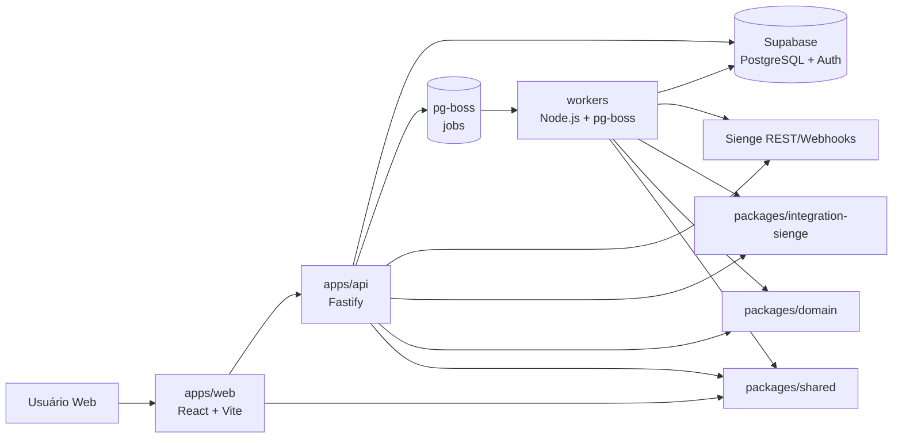
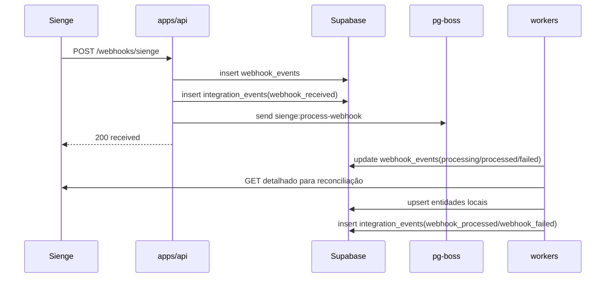
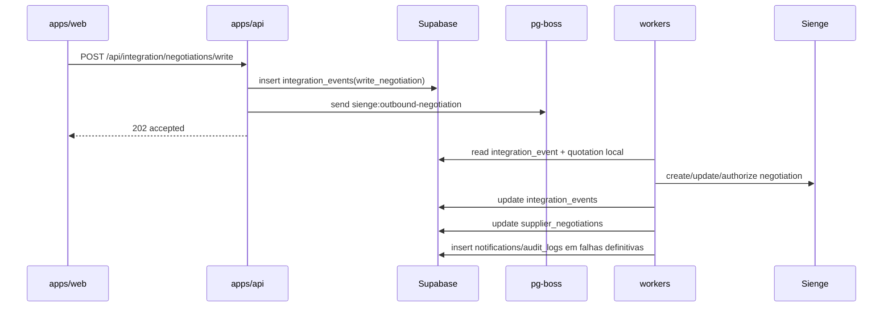
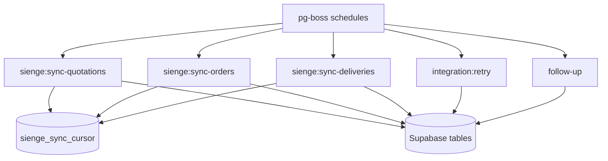

# Arquitetura Atual

Atualizado em `2026-04-17` para refletir o estado real do monorepo.

## 1. Visão geral

O projeto opera como um monorepo `pnpm` com cinco blocos principais:

- SPA React em `apps/web`
- API dedicada em `apps/api`
- runtime assíncrono em `workers`
- pacotes compartilhados em `packages/*`
- persistência/autenticação em `supabase`

O sistema foi desenhado para manter:

- operação síncrona curta na API
- processamento assíncrono em `pg-boss`
- dados operacionais locais no Supabase
- Sienge como fonte de verdade externa para cotações, pedidos, entregas e credores

## 2. Diagrama de componentes

## 3. Diagrama de serviços e fluxos

### 3.1 Fluxo inbound por webhook

### 3.2 Fluxo outbound de negociação

### 3.3 Fluxo de polling

## 4. Inventário técnico com versões e racional

| Camada        | Tecnologia                        | Versão observada          | Uso atual                   | Racional                                           |
| ------------- | --------------------------------- | ------------------------- | --------------------------- | -------------------------------------------------- |
| Workspace     | `pnpm`                            | lockfile v10              | gerenciamento do monorepo   | isolamento de dependências e filtros por workspace |
| Frontend      | `react`                           | `19.2.4`                  | SPA                         | ecossistema atual da interface                     |
| Frontend      | `react-router-dom`                | `7.14.0`                  | rotas protegidas e admin    | roteamento moderno e simples                       |
| Frontend      | `vite`                            | `8.0.7`                   | dev server e build          | build rápido para SPA                              |
| Frontend      | `react-hook-form`                 | `7.72.1`                  | formulários de auth e admin | menor custo de renderização                        |
| Frontend      | `axios`                           | `1.15.0`                  | cliente HTTP                | interceptors de auth                               |
| API           | `fastify`                         | `5.8.4`                   | servidor HTTP               | performance, plugins e `inject()`                  |
| API           | `@fastify/jwt`                    | `9.0.1`                   | JWT próprio da aplicação    | autenticação interna e RBAC                        |
| API           | `@fastify/swagger` + `swagger-ui` | `9.4.0` / `5.2.0`         | documentação em `/docs`     | inspeção rápida de contratos                       |
| API           | `fastify-type-provider-zod`       | `4.0.2`                   | validação e tipagem         | reaproveita schemas Zod                            |
| Workers       | `pg-boss`                         | `9.0.3`                   | fila, agendamento e retry   | evita Redis adicional                              |
| Integração    | `axios-retry`                     | `4.5.0`                   | retry HTTP idempotente      | resiliência básica                                 |
| Integração    | `bottleneck`                      | `2.19.5`                  | rate limiting               | controla limites REST/BULK do Sienge               |
| Compartilhado | `zod`                             | `3.23.8` e `4.3.6`        | schemas e validação         | padroniza DTOs e env parsing                       |
| Persistência  | Supabase JS                       | `2.102.1` / `2.39.0`      | acesso ao banco/auth        | cliente padrão do ecossistema                      |
| Testes        | `vitest`                          | `1.6.1`, `2.1.9`, `4.1.4` | unitários e integração      | execução rápida em Node/jsdom                      |
| Qualidade     | `eslint`                          | `9.39.4`                  | lint por workspace          | flat config                                        |
| Qualidade     | `prettier`                        | `3.8.1`                   | formatação                  | padronização transversal                           |

### Observações de arquitetura técnica

- Há heterogeneidade de versões de `vitest`, `typescript`, `@types/node`, `zod` e `@supabase/supabase-js` entre workspaces.
- O pacote `apps/` permanece com um scaffold Vite genérico e não deve ser tratado como aplicação de produção.
- `workers/dist` está presente no repositório; tratar como artefato gerado e não como fonte.

## 5. Estrutura de diretórios e aderência

| Diretório                     | Papel                    | Aderência observada | Observações                                                                    |
| ----------------------------- | ------------------------ | ------------------- | ------------------------------------------------------------------------------ |
| `apps/web`                    | frontend real            | boa                 | rotas e contexto coerentes com o módulo                                        |
| `apps/api`                    | backend real             | boa                 | módulos separados por domínio                                                  |
| `workers`                     | processamento assíncrono | boa                 | jobs segregados por caso de uso                                                |
| `packages/domain`             | domínio                  | média               | entidades centrais existem, mas parte da regra ainda está nos controllers/jobs |
| `packages/integration-sienge` | infraestrutura de ERP    | boa                 | clientes e mapeadores bem segmentados                                          |
| `packages/shared`             | contratos                | boa                 | schemas Zod e tipos compartilhados                                             |
| `supabase`                    | plataforma de dados      | boa                 | migrações versionadas e config local clara                                     |
| `apps`                        | residual de template     | baixa               | manter só como diretório contêiner; não usar como referência funcional         |

## 6. Banco de dados e Supabase

### 6.1 Configuração local observada

- API local: `54321`
- PostgreSQL local: `54322`
- Studio local: `54323`
- Inbucket: `54324`
- PostgreSQL major: `17`
- `auth.site_url`: `http://127.0.0.1:3000`

### 6.2 Grupos principais de tabelas

Identidade e acesso:

- `profiles`
- `audit_logs`

Operação de fornecedores/cotações:

- `suppliers`
- `supplier_contacts`
- `purchase_quotations`
- `purchase_quotation_items`
- `supplier_negotiations`
- `supplier_negotiation_items`

Pedidos e logística:

- `purchase_orders`
- `purchase_order_items`
- `delivery_schedules`
- `deliveries`
- `purchase_invoices`
- `invoice_items`
- `order_quotation_links`
- `invoice_order_links`
- `follow_up_trackers`
- `damages`
- `notifications`

Integração Sienge:

- `integration_events`
- `webhook_events`
- `sienge_sync_cursor`
- `sienge_credentials`

### 6.3 RLS e governança

- RLS está habilitado nas tabelas principais
- políticas de leitura para fornecedor usam `public.get_auth_supplier_id()`
- backend e workers usam `service_role`, então bypassam RLS quando necessário
- triggers de `updated_at` existem em boa parte das entidades operacionais

## 7. Configuração de ambiente e integrações externas

### 7.1 Modelo atual de env

- `.env.example` na raiz documenta o conjunto consolidado
- `apps/api/.env.example` documenta variáveis reais da API
- `workers/.env.example` documenta runtime do worker
- `apps/web/.env` e `apps/api/.env` existem localmente no workspace

### 7.2 Problemas encontrados

- arquivos `.env` com credenciais reais estão versionados no workspace local
- `SIENGE_ENCRYPTION_KEY` já aparece nos exemplos, mas o código atual usa diretamente `encryptSiengeCredential`/`decryptSiengeCredential`; o mecanismo exato de chave deve permanecer alinhado com `packages/integration-sienge/crypto.ts` [VERIFICAR]
- `DATABASE_URL` é opcional na API, mas obrigatório nos workers

### 7.3 Integrações externas observadas

- Supabase Auth e PostgreSQL
- API REST do Sienge
- webhooks Sienge (`x-sienge-id`, `x-sienge-event`, `x-sienge-hook-id`, `x-sienge-tenant`)
- GitHub Actions para CI

Não há integração de deploy automatizado versionada para Vercel, Railway, Fly.io ou containers [VERIFICAR].

## 8. Auditoria de dependências

### 8.1 Vulnerabilidades confirmadas (`pnpm audit`)

| Severidade | Pacote                       | Faixa afetada        | Impacto observado                             |
| ---------- | ---------------------------- | -------------------- | --------------------------------------------- |
| crítica    | `fast-jwt`                   | `<6.2.0` / `<=6.1.0` | confusão de cache/algoritmo em JWT            |
| alta       | `fastify`                    | `5.3.2..5.8.4`       | bypass de validação de schema por header      |
| moderada   | `vite` transitivo            | `<=6.4.1`            | traversal em `.map`                           |
| moderada   | `follow-redirects`           | `<=1.15.11`          | vazamento de headers em redirect cross-domain |
| moderada   | `@fastify/static` transitivo | `<=9.1.0`            | traversal/bypass em listagem e guarda de rota |

### 8.2 Oportunidades de atualização

Patch/baixo risco:

- `fastify 5.8.4 -> 5.8.5`
- `prettier 3.8.1 -> 3.8.3`
- `react-router-dom 7.14.0 -> 7.14.1`
- `typescript-eslint 8.58.1 -> 8.58.2`
- `@supabase/supabase-js 2.102.1 -> 2.103.3`

Planejamento controlado:

- `@fastify/jwt 9 -> 10`
- `pg-boss 9 -> 12`
- `zod 3 -> 4` em API/shared/web
- unificação de `vitest`
- unificação de `typescript`

## 9. Fluxo de desenvolvimento até deployment

### 9.1 Desenvolvimento local

1. `pnpm install`
2. configurar envs por módulo
3. subir `apps/web`, `apps/api` e `workers`
4. usar `pnpm -r run test`, `build`, `lint`

### 9.2 Qualidade local

- pre-commit via Husky roda `lint-staged`
- `lint-staged.config.mjs` agrupa arquivos por workspace e executa `eslint --fix` + `prettier --write`
- não há validação automática de mensagem de commit

### 9.3 CI/CD observado

Pipeline:

1. checkout
2. Node 20
3. pnpm 10
4. cache do store
5. `pnpm install --frozen-lockfile`
6. `pnpm run format:check`
7. `pnpm run lint`
8. `pnpm run test`
9. `pnpm -r run build`

### 9.4 Branching strategy observada

- somente branch `main` existe no remoto observado
- PR gate é implícito pela workflow em `pull_request` para `main`
- convenção de branching não está documentada no repositório [VERIFICAR]

### 9.5 Code review process observado

- revisão depende de PR + CI verde
- não há `CODEOWNERS`, checklist de PR ou template de revisão versionados [VERIFICAR]

## 10. Padrões de código estabelecidos

Padrões confirmados:

- controllers/rotas/plugins no backend
- jobs especializados por tipo de sincronização no worker
- schemas Zod em `packages/shared`
- enums e entidades em `packages/domain`
- mapeadores e clientes em `packages/integration-sienge`
- uso extensivo de `upsert` em syncs
- auditoria em `audit_logs` e `integration_events`

Débitos técnicos confirmados:

- presença de `any` em API/workers
- parte da regra de negócio ainda orquestrada diretamente em controllers/jobs
- frontend usa `Math.random()` para `id` de input, o que pode gerar instabilidade em re-renderização

## 11. Mudanças recentes desde a baseline documental anterior

### Commits principais

- `ada641a` (`2026-04-10`): base de PRD-07, tipos Sienge e migração `integration_tables_prd07`
- `0fb49dd` (`2026-04-16`): módulos de integração/webhooks, workers principais e expansão do pacote de integração
- `44669cd` (`2026-04-16`): cobertura de testes, melhorias de cursores e runbooks

### Working tree atual

- tela administrativa de eventos de integração
- payload completo de webhook persistido
- outbound com `endpoint` e `http_method` corretos
- notificações operacionais para `Compras`
- janelas explícitas de data para sync/health check de cotações

## 12. Conclusão técnica

O codebase já ultrapassou a fase de bootstrap e tem uma arquitetura coerente para o escopo atual. Os principais pontos pendentes não são de estrutura, e sim de:

- endurecimento de segurança e rotação de segredos
- atualização de dependências vulneráveis
- saneamento de lint
- formalização da estratégia de deploy e governança de revisão
