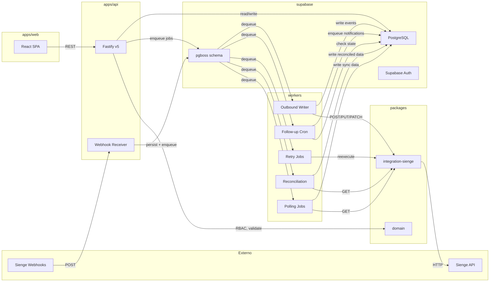
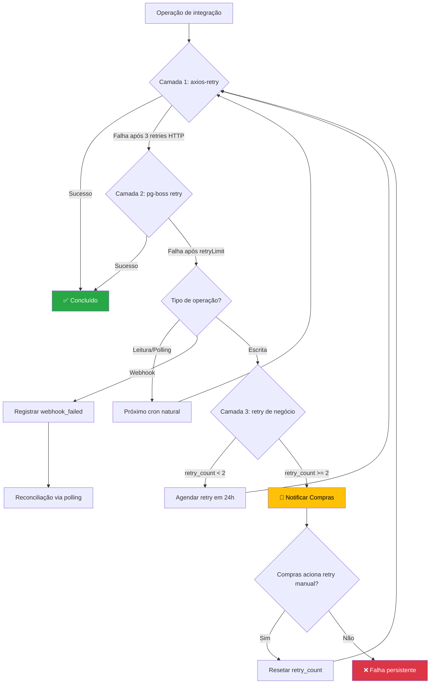

# Fronteira de Integração — API / Workers / Supabase

> **Status:** Definido  
> **Data:** 2026-04-10  
> **Validação:** V1 do plano de validação (setup.md §validações)  
> **Referências:** architecture.md, ADR-0002, ADR-0004, PRD-07, PRD-02

---

## 1. Objetivo

Este documento define **qual camada do sistema é responsável por cada operação** de integração com o Sienge e processamento de dados. A fronteira é tripartite:

- **`apps/api`** — Ciclo HTTP síncrono (recebimento, orquestração, RBAC, escrita controlada)
- **`workers/`** — Processamento assíncrono (polling, retries, follow-up, reconciliação)
- **`supabase/`** — Persistência, auth, RLS, triggers e funções de banco

O objetivo é garantir que nenhuma operação fique sem dono, nenhuma seja duplicada entre camadas, e que as restrições de tempo de execução de cada plataforma sejam respeitadas.

---

## 2. Princípios de distribuição

| Princípio                    | Descrição                                                                        |
| ---------------------------- | -------------------------------------------------------------------------------- |
| **Síncrono na API**          | Operações que respondem a uma requisição HTTP do usuário ou sistema externo      |
| **Assíncrono no Worker**     | Operações que não cabem no ciclo de request/response (polling, retry, cron)      |
| **Persistência no Supabase** | Dados, auth, RLS, triggers de auditoria e funções SQL auxiliares                 |
| **Domínio no packages/**     | Regras de negócio, validações e transformações reutilizáveis entre API e workers |
| **Integração isolada**       | Toda comunicação com o Sienge passa por `packages/integration-sienge`            |

### Regra de ouro

> Se a operação depende de um **usuário aguardando resposta** → API.  
> Se a operação precisa **rodar sem usuário presente** → Worker.  
> Se a operação envolve **integridade referencial ou controle de acesso** → Supabase (RLS/triggers).

---

## 3. Mapa de responsabilidades por operação

### 3.1 Autenticação e RBAC (PRD-01) — ✅ Implementado

| Operação                       | Camada                  | Justificativa                                                        |
| ------------------------------ | ----------------------- | -------------------------------------------------------------------- |
| Login / logout                 | `apps/api` + `supabase` | Supabase Auth gerencia sessão; API valida e enriquece com `profiles` |
| Primeiro acesso (set password) | `apps/api` + `supabase` | API orquestra; Supabase Auth persiste credencial                     |
| RBAC (verificação de perfil)   | `apps/api`              | Hook de lifecycle no Fastify (beforeHandler)                         |
| CRUD de perfis (admin)         | `apps/api`              | Endpoint REST com RBAC; Supabase persiste em `profiles`              |
| RLS por perfil                 | `supabase`              | Policies em `public.profiles` e tabelas de negócio                   |
| Trigger de auditoria           | `supabase`              | Função `audit_log()` dispara em DDL/DML relevantes                   |

### 3.2 Cotação — Importação (PRD-02 §6.1 + PRD-07 §6.1)

| Operação                                                 | Camada                                       | Justificativa                                             |
| -------------------------------------------------------- | -------------------------------------------- | --------------------------------------------------------- |
| Polling periódico de cotações                            | **`workers/`**                               | Job cron `sienge-polling` — não pode depender de HTTP     |
| `GET /purchase-quotations/all/negotiations`              | `workers/` via `packages/integration-sienge` | Paginação automática, rate limit, retry via `axios-retry` |
| Parser de response (suppliers[] aninhado)                | `packages/integration-sienge`                | Mapeador centralizado; consumido por workers              |
| Persistir cotações em `quotation` + `quotation_supplier` | `workers/` → `supabase`                      | Worker escreve via `supabase-js` ou SQL direto            |
| Buscar email do fornecedor (`GET /creditors/{id}`)       | `workers/` via `packages/integration-sienge` | Complementação de dados na mesma pipeline de sync         |
| Marcar fornecedor sem email como bloqueado               | `workers/` → `supabase`                      | RN-05 do PRD-07                                           |
| Registrar `integration_event` de sync                    | `workers/` → `supabase`                      | Auditoria de integração                                   |

### 3.3 Cotação — Operações do Backoffice (PRD-02 §6.2–6.4)

| Operação                                                            | Camada         | Justificativa                                                   |
| ------------------------------------------------------------------- | -------------- | --------------------------------------------------------------- |
| Listar cotações (`GET /api/quotations`)                             | **`apps/api`** | Leitura síncrona com RBAC                                       |
| Detalhar cotação (`GET /api/quotations/:id`)                        | `apps/api`     | Leitura síncrona com RBAC e isolamento por perfil               |
| Definir `end_date`                                                  | `apps/api`     | Validação de negócio (imutável após envio)                      |
| Enviar cotação ao fornecedor                                        | `apps/api`     | Ação do usuário `Compras` (síncrona); dispara notificação async |
| Aprovar / reprovar / solicitar correção                             | `apps/api`     | Ação manual de `Compras` com RBAC                               |
| Listar cotações do fornecedor (`GET /api/supplier/quotations`)      | `apps/api`     | Leitura síncrona com isolamento por `supplier_id`               |
| Marcar cotação como lida (`POST /api/supplier/quotations/:id/read`) | `apps/api`     | Ação do fornecedor (síncrona)                                   |

### 3.4 Cotação — Resposta do Fornecedor (PRD-02 §6.3)

| Operação                                                        | Camada                         | Justificativa                                         |
| --------------------------------------------------------------- | ------------------------------ | ----------------------------------------------------- |
| Submeter resposta (`POST /api/supplier/quotations/:id/respond`) | **`apps/api`**                 | Ação do fornecedor aguardando confirmação             |
| Validar data de entrega obrigatória                             | `apps/api` + `packages/domain` | Regra de negócio validada na API, definida no domínio |
| Persistir resposta + itens + entregas                           | `apps/api` → `supabase`        | Transação atômica                                     |
| Edição e reenvio de resposta                                    | `apps/api`                     | Validação de prazo + ausência de aprovação final      |

### 3.5 Cotação — Integração Outbound (PRD-02 §6.5 + PRD-07 §6.4)

| Operação                                                   | Camada                                           | Justificativa                                                  |
| ---------------------------------------------------------- | ------------------------------------------------ | -------------------------------------------------------------- |
| Acionar envio ao Sienge após aprovação                     | **`apps/api`** → enfileira job no **`workers/`** | API registra aprovação e publica job; worker executa a escrita |
| Verificar fornecedor no mapa de cotação (RN-10)            | `workers/` via `packages/integration-sienge`     | Validação antes de POST                                        |
| `POST /negotiations` (criar negociação)                    | `workers/` via `packages/integration-sienge`     | Escrita idempotente com retry                                  |
| `PUT /negotiations/{n}` (atualizar negociação)             | `workers/` via `packages/integration-sienge`     | Escrita idempotente                                            |
| `PUT /negotiations/{n}/items/{item}` (atualizar itens)     | `workers/` via `packages/integration-sienge`     | Escrita idempotente                                            |
| `PATCH /negotiations/latest/authorize`                     | `workers/` via `packages/integration-sienge`     | Somente após aprovação de `Compras` (já garantida pela API)    |
| Registrar `integration_event` de escrita                   | `workers/` → `supabase`                          | Auditoria com `idempotency_key`                                |
| Reprocessamento manual (`POST /api/.../retry-integration`) | `apps/api` → enfileira no `workers/`             | API valida RBAC e publica job de retry                         |

### 3.6 Cotação — Webhooks (PRD-02 §6.7 + PRD-07 §6.5)

| Operação                                                         | Camada                                       | Justificativa                                  |
| ---------------------------------------------------------------- | -------------------------------------------- | ---------------------------------------------- |
| Receber webhook (`POST /webhooks/sienge`)                        | **`apps/api`**                               | Endpoint HTTP para recebimento externo         |
| Persistir payload em `webhook_events` (status `received`)        | `apps/api` → `supabase`                      | Persistência imediata para auditoria           |
| Enfileirar processamento assíncrono                              | `apps/api` → **`workers/`**                  | API apenas recebe e persiste; worker processa  |
| Processar `PURCHASE_ORDER_GENERATED_FROM_NEGOCIATION`            | `workers/`                                   | Criar vínculo pedido-cotação + reconsultar API |
| Processar `PURCHASE_QUOTATION_NEGOTIATION_AUTHORIZATION_CHANGED` | `workers/`                                   | Reconsultar status da negociação               |
| Processar `PURCHASE_ORDER_ITEM_MODIFIED`                         | `workers/`                                   | Reconsultar itens do pedido                    |
| Reconciliação webhook + API REST                                 | `workers/` via `packages/integration-sienge` | RN-08, RN-09 do PRD-07                         |
| Atualizar `webhook_events` para `processed` / `failed`           | `workers/` → `supabase`                      |                                                |

### 3.7 Pedidos e Entregas (PRD-07 §6.2–6.3)

| Operação                                                                     | Camada                                       | Justificativa               |
| ---------------------------------------------------------------------------- | -------------------------------------------- | --------------------------- |
| Polling de pedidos (`GET /purchase-orders`)                                  | **`workers/`**                               | Job cron `sienge-polling`   |
| Buscar detalhes (`GET /purchase-orders/{id}`)                                | `workers/` via `packages/integration-sienge` |                             |
| Buscar itens (`GET /purchase-orders/{id}/items`)                             | `workers/` via `packages/integration-sienge` |                             |
| Buscar entregas programadas (`GET .../delivery-schedules`)                   | `workers/` via `packages/integration-sienge` |                             |
| Vincular pedido ↔ cotação (§9.6)                                             | `workers/` + `packages/domain`               | Regra de vínculo no domínio |
| Polling de entregas atendidas (`GET /purchase-invoices/deliveries-attended`) | **`workers/`**                               | Job cron `sienge-polling`   |
| Complementar NF (`GET /purchase-invoices/{seq}`)                             | `workers/` via `packages/integration-sienge` |                             |
| Vincular NF → pedido → cotação (§9.7)                                        | `workers/` + `packages/domain`               |                             |

### 3.8 Follow-up Logístico (PRD-04)

| Operação                                 | Camada                  | Justificativa                                 |
| ---------------------------------------- | ----------------------- | --------------------------------------------- |
| Scheduler diário da régua de follow-up   | **`workers/`**          | Job cron via pg-boss `scheduleJob` (ADR-0004) |
| Calcular dias úteis e datas de cobrança  | `packages/domain`       | Regra de negócio pura                         |
| Verificar cotações pendentes de resposta | `workers/` → `supabase` | Consulta de estado                            |
| Enfileirar notificações de follow-up     | `workers/` → `supabase` | Persistir na fila de notificações             |

### 3.9 Retry e Reprocessamento (PRD-07 §6.6)

| Operação                                                           | Camada                                       | Justificativa                   |
| ------------------------------------------------------------------ | -------------------------------------------- | ------------------------------- |
| Identificar eventos `retry_scheduled` com `next_retry_at <= NOW()` | **`workers/`**                               | Job cron `retry-integration`    |
| Reexecutar operação com mesma `idempotency_key`                    | `workers/` via `packages/integration-sienge` |                                 |
| Atualizar `retry_count` e `status`                                 | `workers/` → `supabase`                      |                                 |
| Notificar `Compras` quando `retry_count >= max_retries`            | `workers/` → (fila de notificações)          | PRD-07 RN-13                    |
| Reprocessamento manual (`POST /api/.../retry`)                     | `apps/api` → enfileira no `workers/`         | API valida RBAC; worker executa |

### 3.10 Encerramento de Cotações (PRD-02 §6.6)

| Operação                                            | Camada                              | Justificativa   |
| --------------------------------------------------- | ----------------------------------- | --------------- |
| Verificar cotações com `end_date` ultrapassada      | **`workers/`**                      | Job cron diário |
| Marcar fornecedores sem resposta como `no_response` | `workers/` → `supabase`             |                 |
| Notificar `Compras`                                 | `workers/` → (fila de notificações) |                 |

### 3.11 Supabase — Persistência e Controle

| Operação                                       | Camada         | Tipo               |
| ---------------------------------------------- | -------------- | ------------------ |
| RLS por perfil em todas as tabelas de negócio  | **`supabase`** | Policy             |
| Trigger de auditoria em ações críticas         | `supabase`     | Function + Trigger |
| Schema `pgboss` para filas do worker           | `supabase`     | Schema auto-criado |
| Constraints de integridade referencial         | `supabase`     | FK, UNIQUE, CHECK  |
| `sienge_sync_cursor` — estado de sincronização | `supabase`     | Tabela             |
| `webhook_events` — log de webhooks             | `supabase`     | Tabela             |
| `integration_events` — log de integração       | `supabase`     | Tabela             |

---

## 4. Diagrama de fluxo de dados



---

## 5. Padrão de comunicação API ↔ Workers

A API **nunca** executa operações de integração diretamente com o Sienge. O padrão é:

```
1. API recebe request do usuário ou webhook
2. API valida (RBAC, schema, regras síncronas)
3. API persiste estado transicional no banco
4. API publica job no pg-boss (via supabase SQL ou pg-boss client)
5. API retorna 200/202 ao chamador
6. Worker consome o job
7. Worker executa operação (via packages/integration-sienge)
8. Worker persiste resultado (sucesso/falha/retry)
```

**Exceções:** Leitura direta de dados já sincronizados (ex: listar cotações para o frontend) é feita pela API diretamente contra o Supabase, sem passar pelo worker.

---

## 6. Jobs registrados no pg-boss

| Job Name                   | Tipo      | Frequência                 | Responsabilidade                  | Ref         |
| -------------------------- | --------- | -------------------------- | --------------------------------- | ----------- |
| `sienge:sync-quotations`   | Cron      | A definir (ex: cada 15min) | Polling de cotações do Sienge     | PRD-07 §6.1 |
| `sienge:sync-orders`       | Cron      | A definir                  | Polling de pedidos                | PRD-07 §6.2 |
| `sienge:sync-deliveries`   | Cron      | A definir                  | Polling de entregas atendidas     | PRD-07 §6.3 |
| `sienge:write-negotiation` | On-demand | Publicado pela API         | Escrita de resposta aprovada      | PRD-07 §6.4 |
| `sienge:process-webhook`   | On-demand | Publicado pela API         | Processamento de webhook recebido | PRD-07 §6.5 |
| `sienge:retry-failed`      | Cron      | A definir (ex: cada 1h)    | Reprocessar eventos falhados      | PRD-07 §6.6 |
| `followup:daily-check`     | Cron      | Diário (ex: 08:00 BRT)     | Régua de follow-up logístico      | PRD-04      |
| `quotation:expire-check`   | Cron      | Diário                     | Encerrar cotações vencidas        | PRD-02 §6.6 |

---

## 7. Restrições e guardrails

| #   | Restrição                                                                                        | Ref             |
| --- | ------------------------------------------------------------------------------------------------ | --------------- |
| 1   | A API **não** faz polling contra o Sienge                                                        | ADR-0004        |
| 2   | A API **não** executa escrita no Sienge diretamente                                              | architecture.md |
| 3   | Workers **não** expõem rotas HTTP                                                                | ADR-0004        |
| 4   | Toda escrita no Sienge passa por `packages/integration-sienge`                                   | CLAUDE.md §4    |
| 5   | Toda regra de negócio vive em `packages/domain`                                                  | CLAUDE.md §4    |
| 6   | `apps/web` nunca se comunica com workers diretamente                                             | architecture.md |
| 7   | Frontend nunca chama API do Sienge diretamente                                                   | CLAUDE.md §8    |
| 8   | Webhooks são recebidos pela API e processados pelo worker                                        | PRD-07 §6.5     |
| 9   | Retries de integração são geridos pelo worker, não pela API                                      | PRD-07 §6.6     |
| 10  | Rate limit do Sienge (200/min REST, 20/min BULK) é controlado pela `packages/integration-sienge` | PRD-07 RN-03    |

---

## 8. Decisões documentadas neste ADR

1. **Webhook = receive + enqueue.** A API recebe o webhook, persiste o payload, e publica um job. Não processa inline.
2. **Escrita outbound = job.** Toda escrita no Sienge (POST/PUT/PATCH) é executada por um worker job, nunca sincrono na API.
3. **Polling = job cron.** Toda sincronização de leitura (cotações, pedidos, entregas) é via job cron do pg-boss.
4. **Reprocessamento manual = API → job.** `Compras` aciona reprocessamento pela API, que publica um job de retry.
5. **Follow-up = job cron diário.** A régua de cobrança é um scheduler diário no pg-boss.
6. **Leitura para frontend = API direta.** A API consulta dados já sincronizados no Supabase para responder ao frontend.

---

## 9. Estratégia de retry e reprocessamento (V6)

> **Validação:** V6 do plano de validação (setup.md §validações)  
> **Referências:** PRDGlobal §12.2, PRD-07 §6.6, ADR-0004, client.ts

### 9.1 Visão geral — 3 camadas de retry

O sistema opera com **3 camadas de retry independentes e complementares**, cada uma com escopo e responsabilidade específica:

```
┌─────────────────────────────────────────────────────────────────────┐
│ Camada 3 — Negócio (operacional)                                    │
│ Responsável: workers/ + packages/domain                             │
│ Escopo: Reenvios de negócio com regras de produto                   │
│ Intervalo: 24h entre tentativas                                     │
│ Limite: 2 reenvios (escrita) / 1 retry (leitura)                    │
│ Após esgotar: Notificar Compras                                    │
│                                                                     │
│   ┌─────────────────────────────────────────────────────────────┐   │
│   │ Camada 2 — Job (persistente)                                │   │
│   │ Responsável: pg-boss (workers/)                             │   │
│   │ Escopo: Retry de jobs que falharam na execução              │   │
│   │ Intervalo: Backoff exponencial (minutos)                    │   │
│   │ Limite: 3-5 tentativas por tipo de job                      │   │
│   │ Após esgotar: Dead-letter + registrar integration_event     │   │
│   │                                                             │   │
│   │   ┌─────────────────────────────────────────────────────┐   │   │
│   │   │ Camada 1 — HTTP (transiente)                        │   │   │
│   │   │ Responsável: axios-retry (packages/integration-sienge)│  │   │
│   │   │ Escopo: Falhas de rede e 5xx em requests idempotentes│   │   │
│   │   │ Intervalo: Backoff exponencial (segundos)           │   │   │
│   │   │ Limite: 3 tentativas                                │   │   │
│   │   │ Após esgotar: Propagar erro ao chamador             │   │   │
│   │   └─────────────────────────────────────────────────────┘   │   │
│   └─────────────────────────────────────────────────────────────┘   │
└─────────────────────────────────────────────────────────────────────┘
```

### 9.2 Camada 1 — HTTP (transiente)

**Implementada em:** `packages/integration-sienge/src/client.ts` (linhas 28-45)

| Parâmetro           | Valor                                            | Justificativa                                            |
| ------------------- | ------------------------------------------------ | -------------------------------------------------------- |
| **Retries**         | 3                                                | Suficiente para falhas transientes sem sobrecarregar     |
| **Delay**           | Exponencial (`axiosRetry.exponentialDelay`)      | ~300ms, ~600ms, ~1200ms                                  |
| **Condição**        | `isNetworkOrIdempotentRequestError`              | Apenas GET/HEAD/OPTIONS/PUT/DELETE + NetworkError ou 5xx |
| **POST/PATCH**      | ❌ **Sem retry automático**                      | Mutações não são seguras para retry cego                 |
| **429 Rate Limit**  | ⚠️ Capturado pela condição padrão                | Rate limit do Sienge (200/min REST)                      |
| **Observabilidade** | `correlationId` + `source` logados em cada retry | Rastreabilidade fim a fim                                |

**Regra:** Esta camada é **invisível** para a camada 2. Se o axios-retry resolver o problema, o job da camada 2 nem percebe que houve falha.

### 9.3 Camada 2 — Job (persistente)

**Implementada via:** pg-boss (configuração por job no `workers/`)

Cada tipo de job tem configuração de retry **diferenciada** conforme a criticidade e natureza da operação:

| Job                        | `retryLimit` | `retryDelay` (s) | `retryBackoff` | `expireInHours` | Justificativa                                                           |
| -------------------------- | ------------ | ---------------- | -------------- | --------------- | ----------------------------------------------------------------------- |
| `sienge:sync-quotations`   | 3            | 60               | `true`         | 1               | Polling — falha temporária; próximo cron corrige                        |
| `sienge:sync-orders`       | 3            | 60               | `true`         | 1               | Idem                                                                    |
| `sienge:sync-deliveries`   | 3            | 60               | `true`         | 1               | Idem                                                                    |
| `sienge:write-negotiation` | 1            | —                | —              | 2               | **Não retratar automaticamente** — escrita crítica delega para Camada 3 |
| `sienge:process-webhook`   | 3            | 30               | `true`         | 1               | Webhook important; retry rápido                                         |
| `sienge:retry-failed`      | 1            | —                | —              | 1               | Cron de reprocessamento — falha no cron não deve gerar retry recursivo  |
| `followup:daily-check`     | 2            | 120              | `true`         | 4               | Diário; uma retry é suficiente                                          |
| `quotation:expire-check`   | 2            | 120              | `true`         | 4               | Idem                                                                    |

**Após esgotar `retryLimit`:** pg-boss move o job para dead-letter (`pgboss.archive` com `state: 'failed'`). O worker deve:

1. Registrar um `integration_event` com status `failure` e detalhes do erro.
2. Para jobs de escrita (`write-negotiation`): **não** re-enfileirar automaticamente — delegar para Camada 3.
3. Para jobs de leitura (polling/sync): a próxima execução cron trata a recuperação.

**Configuração de `singletonKey`:** Jobs de polling usam `singletonKey` para evitar duplicação quando o cron dispara antes do job anterior terminar:

```typescript
// Exemplo de configuração
await boss.schedule(
  'sienge:sync-quotations',
  '*/15 * * * *',
  {},
  {
    retryLimit: 3,
    retryDelay: 60,
    retryBackoff: true,
    expireInHours: 1,
    singletonKey: 'sienge:sync-quotations:singleton',
  },
);
```

### 9.4 Camada 3 — Negócio (operacional)

**Implementada via:** Worker job `sienge:retry-failed` + tabela `integration_events`

Esta camada implementa as **regras de produto** definidas no PRDGlobal §12.2:

#### Para escrita de resposta de cotação (outbound)

| Parâmetro                    | Valor                                          | Referência      |
| ---------------------------- | ---------------------------------------------- | --------------- |
| **Reenvios automáticos**     | 2                                              | PRDGlobal §12.2 |
| **Intervalo entre reenvios** | 24 horas                                       | PRDGlobal §12.2 |
| **Após esgotar**             | Notificar `Compras`                            | PRDGlobal §12.2 |
| **Reprocessamento manual**   | Sem limite na V1.0                             | PRDGlobal §12.2 |
| **Idempotência**             | Mesmo `idempotency_key` em todas as tentativas | PRD-07 §6.4     |

**Fluxo:**

```
1. Job `sienge:write-negotiation` falha (Camada 2 esgotada, retryLimit=1)
2. Handler registra integration_event:
   - status: 'retry_scheduled'
   - retry_count: 0
   - max_retries: 2
   - next_retry_at: NOW() + 24h
   - idempotency_key: UUID gerado na aprovação
3. Cron `sienge:retry-failed` (cada 1h) encontra evento com next_retry_at <= NOW()
4. Worker reexecuta com mesma idempotency_key
5. Se sucesso → status: 'success'
6. Se falha → retry_count++
   - Se retry_count < max_retries → next_retry_at: NOW() + 24h
   - Se retry_count >= max_retries → status: 'failure', notificar Compras
7. Compras pode acionar POST /api/integration/events/{id}/retry a qualquer momento
   - API valida RBAC (perfil Compras)
   - API reseta retry_count e publica novo job
   - Sem limite de tentativas manuais (V1.0)
```

#### Para leitura/sincronização (polling)

| Parâmetro                      | Valor                                   | Referência |
| ------------------------------ | --------------------------------------- | ---------- |
| **Reprocessamento automático** | 1 retry via Camada 2 (pg-boss)          | —          |
| **Intervalo**                  | Backoff do pg-boss (~60s, ~120s, ~240s) | —          |
| **Após esgotar**               | Próxima execução cron natural           | —          |
| **Notificação**                | Apenas se falha persistir por >24h      | —          |

Polling de leitura é **auto-corrigível**: se um ciclo de sync falha, o próximo cron natural tenta novamente. Não é necessário acumular retries de negócio para operações de leitura.

#### Para processamento de webhooks

| Parâmetro               | Valor                                          | Referência  |
| ----------------------- | ---------------------------------------------- | ----------- |
| **Retries via pg-boss** | 3                                              | Camada 2    |
| **Após esgotar**        | Registrar `webhook_failed` + notificar Compras | PRD-07 §6.5 |
| **Reconciliação**       | Próximo ciclo de polling cobrirá a lacuna      | PRD-07 §9.3 |

### 9.5 Idempotência

Toda operação de escrita no Sienge deve ser **idempotente** e **rastreável**:

| Aspecto              | Implementação                                                                               |
| -------------------- | ------------------------------------------------------------------------------------------- |
| **Geração da chave** | UUID v4 gerado no momento da aprovação por `Compras`                                        |
| **Persistência**     | Campo `idempotency_key` em `integration_events`                                             |
| **Scope**            | Uma chave por operação lógica completa (create + update + authorize = 1 chave)              |
| **Verificação**      | Antes de executar escrita, verificar se já existe evento com mesma chave e status `success` |
| **Validade**         | Sem expiração (auditoria permanente)                                                        |

```typescript
// Pseudo-código do handler de escrita
async function handleWriteNegotiation(job: PgBoss.Job) {
  const { quotationResponseId, idempotencyKey } = job.data;

  // Verificar se já foi processado com sucesso
  const existing = await findIntegrationEvent(idempotencyKey, 'success');
  if (existing) {
    console.log(`Already processed: ${idempotencyKey}`);
    return; // Idempotente — não reprocessar
  }

  try {
    // Executar operação via packages/integration-sienge
    await siengeClient.createNegotiation(...);
    await siengeClient.updateNegotiation(...);
    await siengeClient.authorize(...);

    await registerIntegrationEvent({
      idempotencyKey,
      status: 'success',
      eventType: 'negotiation_written',
    });
  } catch (error) {
    await registerIntegrationEvent({
      idempotencyKey,
      status: 'retry_scheduled',
      retryCount: currentRetryCount,
      maxRetries: 2,
      nextRetryAt: addHours(new Date(), 24),
      errorDetails: sanitize(error),
    });
  }
}
```

### 9.6 Diagrama de fluxo de retry



### 9.7 Tabela resumo por tipo de operação

| Operação                 | Camada 1 (HTTP)      | Camada 2 (pg-boss)     | Camada 3 (Negócio)        | Notificação            |
| ------------------------ | -------------------- | ---------------------- | ------------------------- | ---------------------- |
| Polling de cotações      | 3× GET auto          | 3× com backoff         | Próximo cron              | Após 24h sem sucesso   |
| Polling de pedidos       | 3× GET auto          | 3× com backoff         | Próximo cron              | Após 24h sem sucesso   |
| Polling de entregas      | 3× GET auto          | 3× com backoff         | Próximo cron              | Após 24h sem sucesso   |
| Escrita de negociação    | 3× GET auto, ❌ POST | 1× (sem retry pg-boss) | 2× a cada 24h             | Sim, após esgotar      |
| Processamento de webhook | 3× GET auto          | 3× com backoff         | — (polling como fallback) | Sim, se webhook_failed |
| Follow-up diário         | N/A (consulta local) | 2× com backoff         | Próximo cron              | —                      |
| Encerramento de cotação  | N/A (consulta local) | 2× com backoff         | Próximo cron              | —                      |
| Retry de falhas (cron)   | Depende da operação  | 1× (sem meta-retry)    | —                         | —                      |
